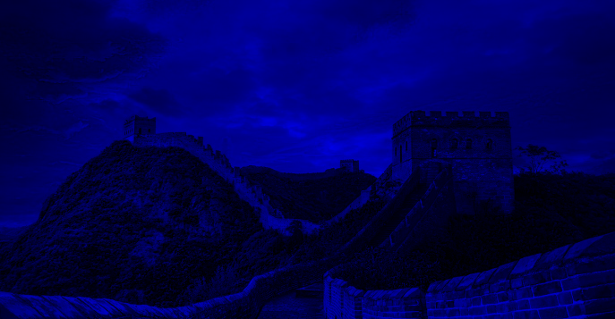
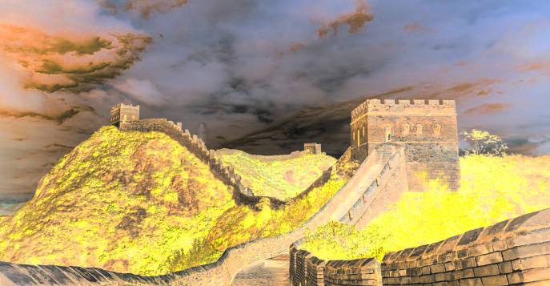

# Лабораторная работа №1
## Цветовые модели и передискретизация изображений

### Цель работы
Изучить представление изображения в цветовой модели RGB и HSI, а также реализовать основные операции передискретизации без использования библиотечных функций масштабирования.

### Исходные данные
- Исходный файл: `image.png`
- Коэффициент растяжения: `M = 3`
- Коэффициент сжатия: `N = 2`
- Итоговый коэффициент передискретизации: `K = M/N = 1.500`

### Исходное изображение

## 1. Цветовые модели

### 1.1 Компоненты R, G, B
| Красный канал | Зеленый канал | Синий канал |
|:-------------:|:-------------:|:-----------:|
|  |  |  |

### 1.2 Яркостная компонента HSI
Яркостная компонента `I` получена после преобразования исходного изображения из RGB в HSI.

### 1.3 Инвертирование яркостной компоненты
В данном пункте была выполнена инверсия яркости по формуле `I' = 1 - I`, после чего изображение было преобразовано обратно в RGB.

| Исходное изображение | Изображение после инверсии яркости |
|:--------------------:|:----------------------------------:|
|  |  |

## 2. Передискретизация

### 2.1 Растяжение в M раз
Для увеличения размера изображения использована билинейная интерполяция.

| Исходное изображение | Растянутое изображение |
|:--------------------:|:----------------------:|
|  |  |

### 2.2 Сжатие в N раз
Для уменьшения изображения использован метод прореживания: выбирался каждый `N`-й пиксель по строкам и столбцам.

| Исходное изображение | Сжатое изображение |
|:--------------------:|:------------------:|
|  |  |

### 2.3 Двухпроходная передискретизация в K = M/N
На первом шаге выполнялось растяжение в `M` раз, на втором — сжатие результата в `N` раз.

| Исходное изображение | Результат двухпроходной обработки |
|:--------------------:|:---------------------------------:|
|  |  |

### 2.4 Однопроходная передискретизация в K
Изменение размера выполнено за один проход непосредственно с коэффициентом `K = 1.500`.

| Исходное изображение | Результат однопроходной обработки |
|:--------------------:|:---------------------------------:|
|  |  |

## Результаты выполнения

| Операция | Размер изображения |
|:---------|-------------------:|
| Исходное изображение | 687x357 |
| Растяжение в `M=3` | 2061x1071 |
| Сжатие в `N=2` | 344x179 |
| Двухпроходная передискретизация | 1031x536 |
| Однопроходная передискретизация | 1030x536 |

## Вывод
В ходе выполнения лабораторной работы были реализованы операции выделения цветовых каналов в модели RGB, вычисления яркостной компоненты в модели HSI и инвертирования яркости. Также были реализованы методы растяжения, сжатия и два варианта передискретизации изображения: двухпроходный и однопроходный. Полученные результаты подтверждают корректность выполненных преобразований и различие подходов к изменению размера изображения.
